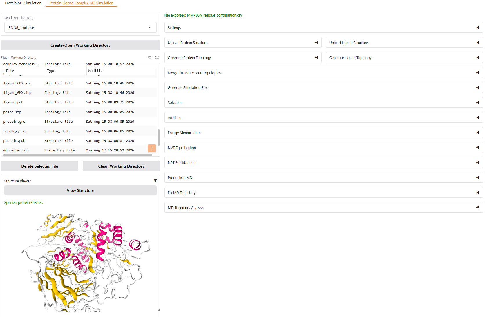
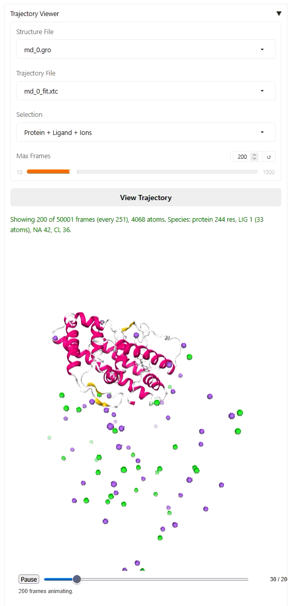
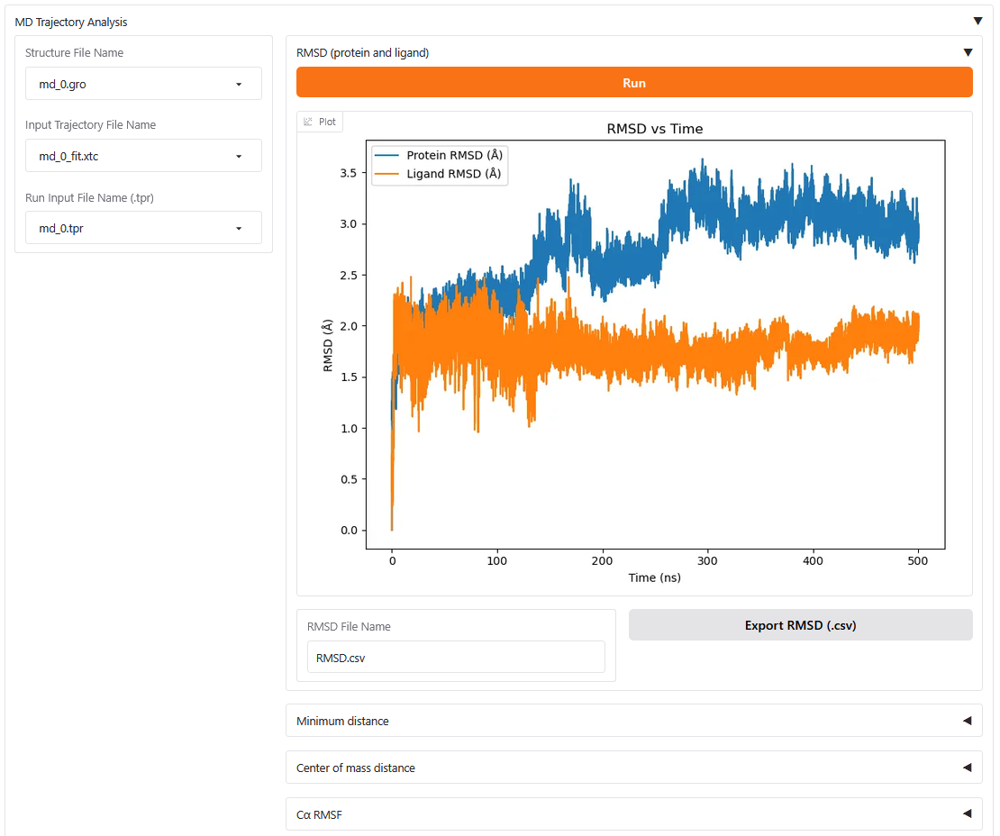
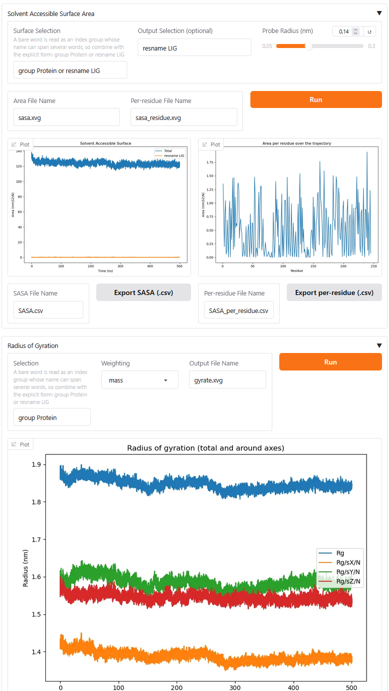
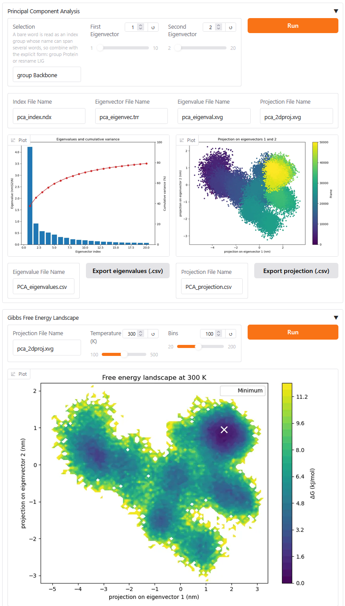
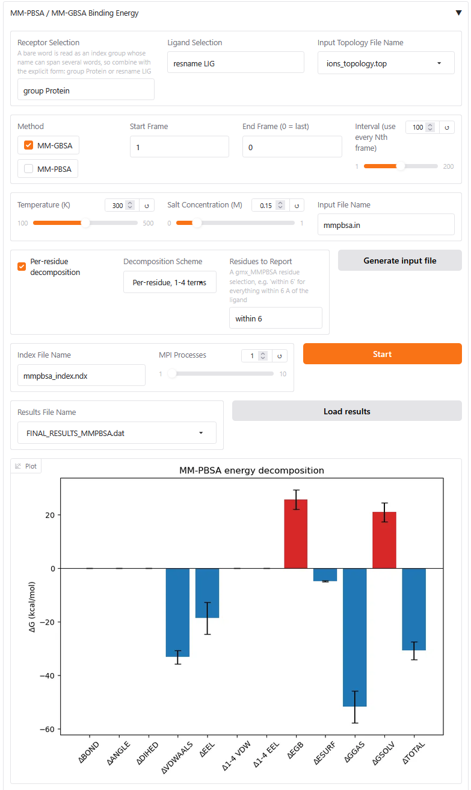
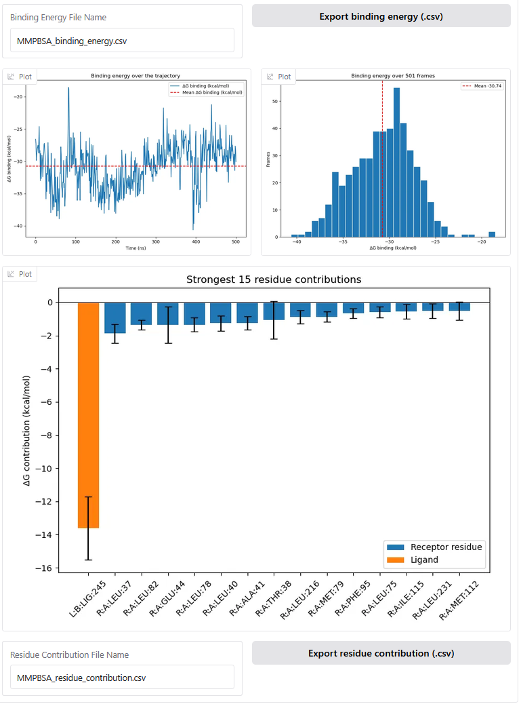

## Introduction
This web UI is for running molecular dynamics simulation with [Gromacs](https://www.gromacs.org/).









## Installation  (Linux only)
- Install [Anaconda](https://www.anaconda.com/download)

- Clone this repo: Open terminal

```
git clone https://github.com/phatdatnguyen/gromacs-webui
```

- Create and activate conda virtual environment:

```
cd gromacs-webui
conda create -p ./gromacs-env python=3.12
conda activate ./gromacs-env
```

- Install packages:

```
python -m pip install gradio parmed nglview==4.0
conda install -c conda-forge acpype mdanalysis
```
- To run MD with machine learning potentials:

```
python -m pip install torch==2.8 --index-url https://download.pytorch.org/whl/cu129
python -m pip install cuequivariance cuequivariance-torch
python -m pip install -v --no-build-isolation --config-settings=--global-option=ext torchani
ani build-extensions --sm 8.9 # use --sm 8.9 for RTX 40X0, --sm 12.0 for RTX 50X0
python -m pip install aimnet
python -m pip install pygit2
python -m pip install git+https://github.com/chemle/emle-engine
python -m pip install mace-torch

```
- To run MM-PBSA / MM-GBSA binding energy calculations:

gmx_MMPBSA pins older numpy, pandas and AmberTools than this application uses, so
it goes in its own environment beside `gromacs-env` and is called as an external
command. Nothing here imports it, so the two dependency sets never meet.

```
conda create -p ./gmx-mmpbsa-env python=3.9
conda install -p ./gmx-mmpbsa-env -c conda-forge gmx_mmpbsa
```

`./gmx-mmpbsa-env` is found automatically, so nothing else is needed. To use an
installation somewhere else, either put its `bin` on `PATH` or point
`GMX_MMPBSA_EXECUTABLE` at the binary:

```
export GMX_MMPBSA_EXECUTABLE=/path/to/env/bin/gmx_MMPBSA
```

The MM-PBSA panel explains what to install if it cannot find the binary, and the
rest of the application works without it.

If `conda install` exits with a segmentation fault partway through, simply run it
again — the transaction is resumable and the second attempt usually completes.

## Analysis

The **MD Trajectory Analysis** section of each tab runs one analysis per button,
so any of them can be re-run on its own:

| Analysis | Backed by | Notes |
| --- | --- | --- |
| RMSD | MDAnalysis | Protein, plus the ligand in the complex tab |
| Minimum distance | MDAnalysis | Complex tab only |
| Center of mass distance | MDAnalysis | Complex tab only |
| Cα RMSF | MDAnalysis | Per residue, with the mean marked |
| SASA | `gmx sasa` | Total over time and averaged per residue |
| Radius of gyration | `gmx gyrate` | Total plus the three axes |
| PCA | `gmx covar`, `gmx anaeig` | Scree plot and the PC1/PC2 projection |
| Gibbs free energy landscape | the PCA projection | G = -kT ln(P/P_max) |
| MM-PBSA / MM-GBSA | `gmx_MMPBSA` | Complex tab only, runs in the background |

MM-PBSA reports the energy decomposition, the binding energy against simulation
time and as a distribution, and the per-residue contributions with the ligand's
own term coloured apart from the receptor residues. The residue chart shows the
strongest contributors; the CSV export keeps every residue. Per-residue
contributions need the **Per-residue decomposition** box ticked before the run,
since they come from a `&decomp` namelist in the generated input file. Frames are
chosen with **Start Frame** / **End Frame** (0 = last) and **Interval**, which
defaults to every 100th frame because a full-length trajectory takes hours
frame by frame.

The `gmx`-backed analyses need a `.tpr`, chosen with the shared **Run Input File
Name** dropdown, and write their `.xvg` output into the job directory alongside
the `.csv` each panel exports. They show the command they are running in their
status line while it runs, since SASA and PCA over a long trajectory take minutes.

The analyses locate the ligand as `resname LIG`, so the complex tab rewrites the
ligand's residue name to `LIG` when you upload it. **Ligand Residue Name** only
needs changing when the uploaded file holds more than the ligand; if the name is
not present in the file, every atom in it is treated as ligand, which also covers
files whose residue name field is empty.

## Start web UI
To start the web UI:

```
conda activate ./gromacs-env
python webui.py
```

## Tests
The suite lives in `tests/` and uses only the standard library's `unittest`, so no
extra packages are needed. Run it from the repository root:

```
conda activate ./gromacs-env
python -m unittest discover
```

Most tests build their own structures and trajectories and run in a few seconds.
The ones in `tests/test_gromacs_workflow.py` drive the real `gmx` binaries and skip
themselves when GROMACS is not on `PATH`; the CHARMM tests additionally skip when
`charmm36` is not installed in the GROMACS tree. Each test works inside a
throwaway directory under `./data/`, cleaned up afterwards.

To run one module or one test:

```
python -m unittest tests.test_utils_species
python -m unittest tests.test_viewers.TrajectoryReductionTests.test_stride_is_computed_to_respect_the_cap
```
