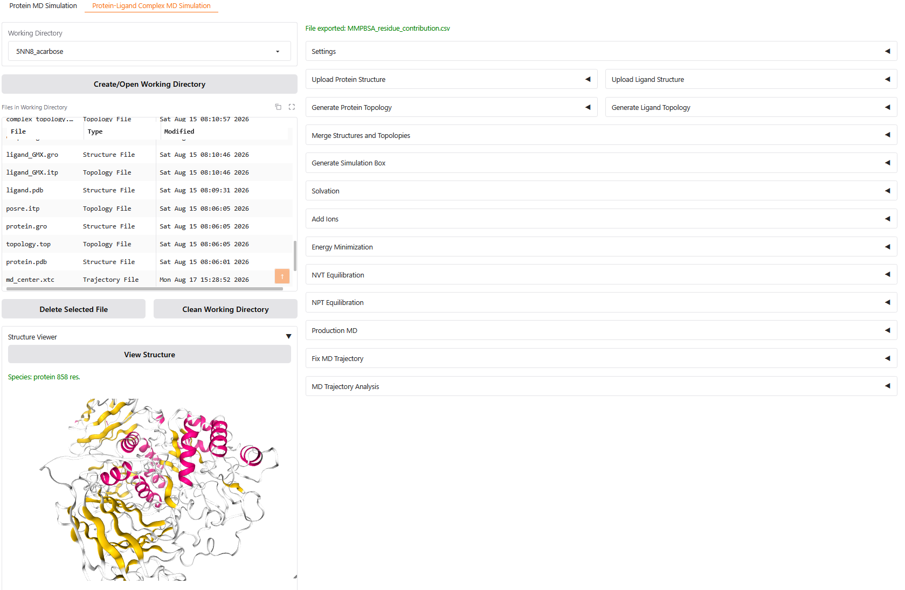
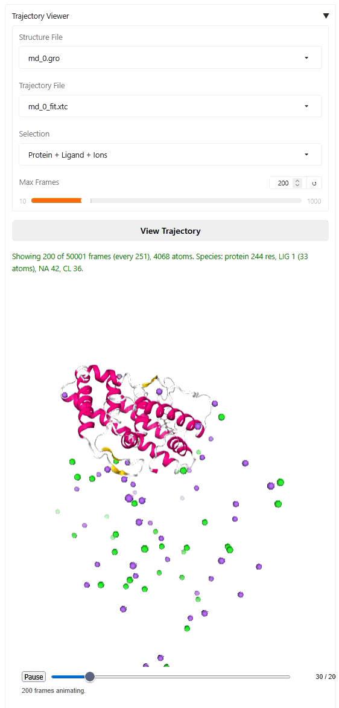
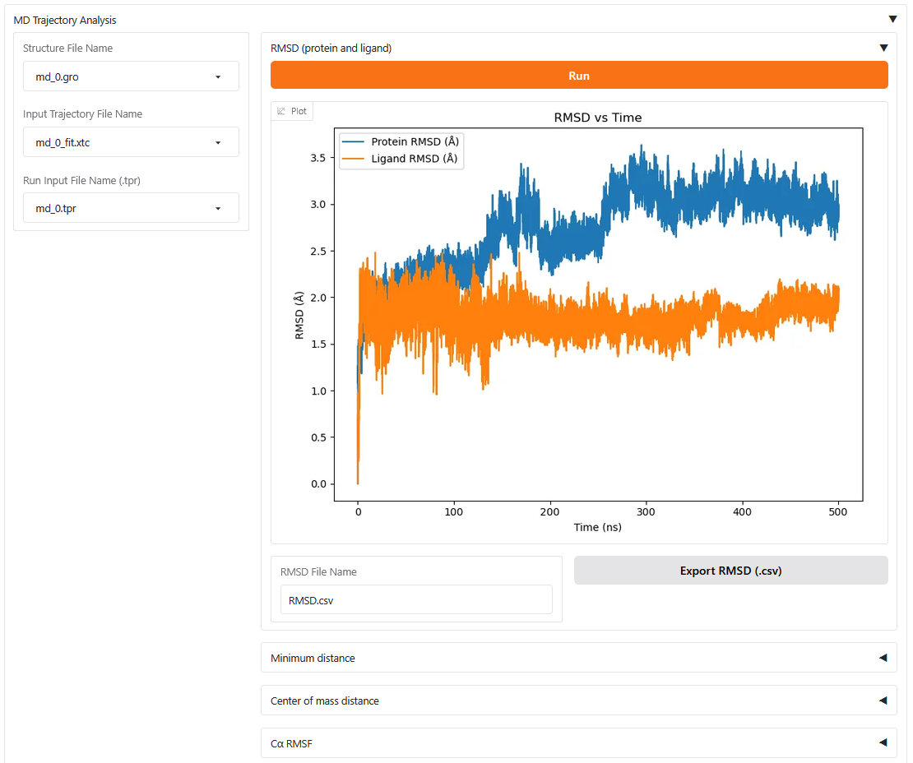
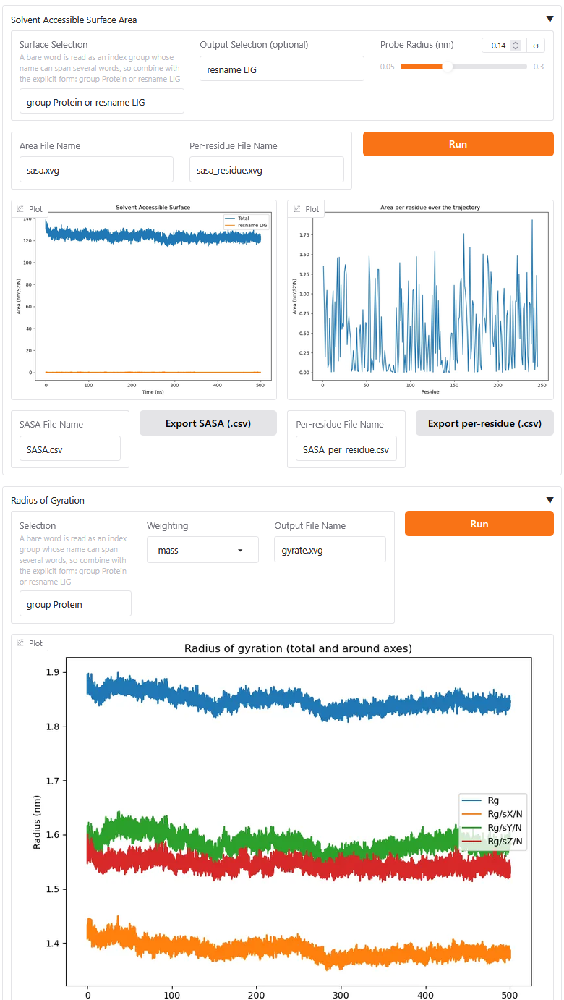
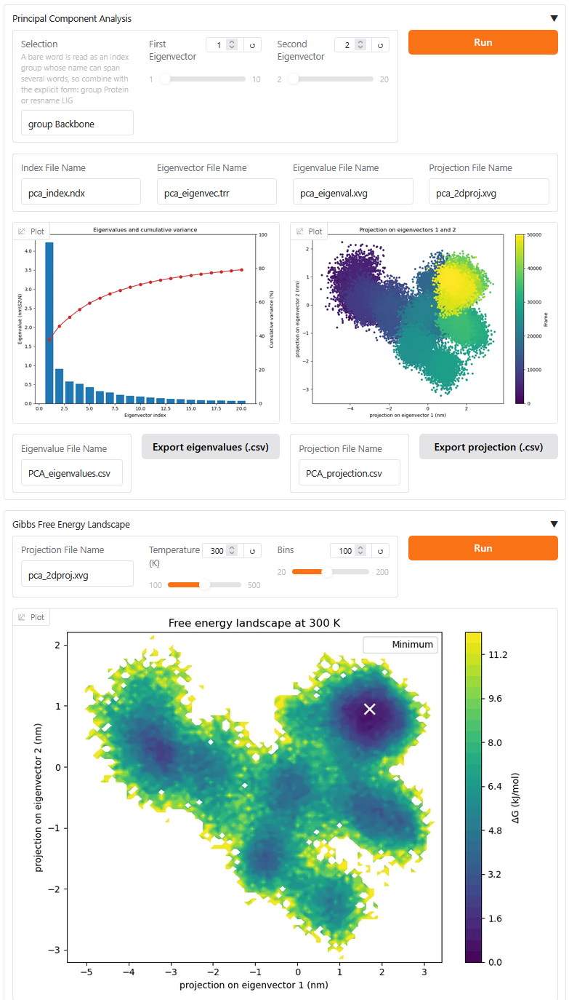
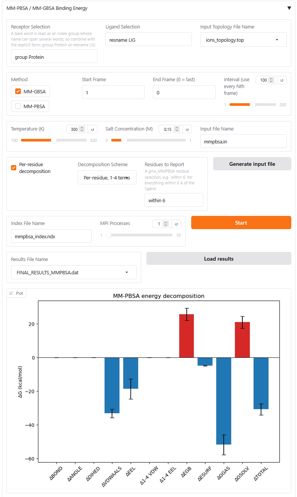
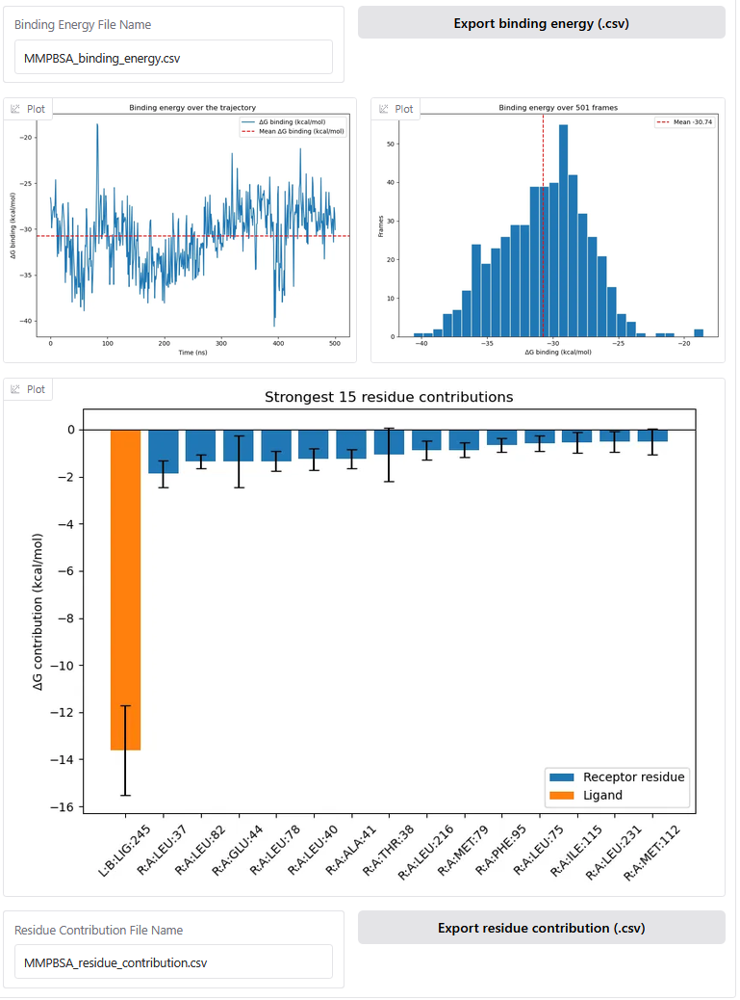

## Introduction
This web UI is for running molecular dynamics simulation with [Gromacs](https://www.gromacs.org/).









## Installation  (Linux only)
- Install [Anaconda](https://www.anaconda.com/download)

- Clone this repo: Open terminal

```
git clone https://github.com/phatdatnguyen/gromacs-webui
```

- Create and activate conda virtual environment:

```
cd gromacs-webui
conda create -p ./gromacs-env python=3.12
conda activate ./gromacs-env
```

- Install packages:

```
python -m pip install gradio parmed nglview==4.0
conda install -c conda-forge gromacs acpype mdanalysis
```
- To run protein-ligand complex MD with machine learning potentials:

NNPot/MLIP support is intentionally available only in the **Protein-Ligand
Complex MD Simulation** workflow. The protein-only workflow remains classical
and rejects both edited NNPot MDP files and NNPot-enabled TPR files.

```
# Example exporter stack for a GROMACS build linked to LibTorch 2.8:
python -m pip install torch==2.8.0 --index-url https://download.pytorch.org/whl/cu128
python -m pip install torchani==2.9.0
python -m pip install pygit2==1.20.1
python -m pip install git+https://github.com/chemle/emle-engine@51881369d315447448bdb4fdfecc618ac7577010
python -m pip install mace-torch==0.3.16

```

The Python packages above export the TorchScript model; GROMACS must separately
be compiled with its NNPot Torch backend. Check the binary that the WebUI will
run with `gmx --version`: it must report `Torch support: enabled`. Build GROMACS
with `-DGMX_NNPOT=TORCH`. Matching the GROMACS LibTorch and model-exporter
PyTorch major/minor versions is required for CPU NNP runs and strongly
recommended for GPU runs; the WebUI blocks a CPU mismatch and warns about a GPU
mismatch. It also checks the selected model's Python packages and GROMACS
capability before it starts a model download.

The ANI wrappers deliberately use TorchANI's pure-PyTorch AEV implementation,
so its optional compiled extensions are not required and are not embedded into
the exported model.

All bundled models currently require a neutral NNP region. Stock GROMACS
2026.4 exposes `nnp-charge` as a model input but does not expose an MDP setting
for its value or derive it from the selected topology group, so it always sends
zero. The WebUI measures the original group's topology charge before GROMACS
modifies it and rejects charged groups, including for ANI2x-EMLE. MACE-OFF uses
GROMACS' periodic neighbor pairs at its 0.5 nm cutoff, and ANI2x-EMLE uses
electrostatic embedding with the surrounding MM atoms.

In the complex workflow, the WebUI creates the fixed `nnpot` input group when
it generates an NNP production MDP. Choose **Ligand** for the ligand alone, or
**Ligand and binding residues** to add every complete protein residue having an
atom within 0.5 nm of the ligand in the selected production input structure.
The resulting `nnpot.ndx` file is supplied explicitly to GROMACS. The generated
MDP records its index digest, so TPR generation refuses a `nnpot.ndx` belonging
to another MDP. When a TPR is generated, the WebUI also stores an immutable,
hash-bound snapshot of the exact index used by `grompp`; launch-time checks use
that snapshot rather than a later replacement of `nnpot.ndx`. Regenerate the
MDP and index after changing the atom ordering/identity or region choice, then
regenerate the TPR. Coordinates, velocities, and the box may change without
invalidating the index, so ordinary continuation structures remain compatible.
Membership is fixed from the structure used to create the index and cannot gain
or lose residues as atoms move during a run; account for link atoms at covalent
NNP/MM boundaries. Choose the region with the model's supported elements and
charge limitations in mind:

| Model | Supported elements | Charge requirement |
| --- | --- | --- |
| ANI-1x | H, C, N, O | neutral |
| ANI-2x | H, C, N, O, S, F, Cl | neutral |
| ANI2x-EMLE | H, C, N, O, S | neutral with stock GROMACS 2026.4 |
| MACE-OFF | H, C, N, O, F, P, S, Cl, Br, I | neutral |

The WebUI validates the selected group before `mdrun`, including ligand atomic
numbers, and keeps a hashed, read-only model snapshot with each job so later
cache rebuilds cannot change an existing simulation. A successful NNP `grompp`
also writes a hash-bound charge attestation; regenerate older NNP TPR files in
the WebUI before running them; legacy jobs must regenerate both the production
MDP and TPR so they receive an immutable model snapshot. All bundled wrappers
require GROMACS 2026 or newer because they consume the 2026 `nnp-charge` model
input. MACE requires GROMACS 2026.4 or newer because 2026.0-3 computed incorrect
NNPot pair shifts in triclinic boxes. NNP production runs use a fixed box
(`pcoupl = no`), no bond constraints, and a maximum 0.001 ps (1 fs) time step.
The fixed box is required because these wrappers do not return virial/stress;
removing constraints avoids altering the learned subsystem's potential-energy
surface.

- To run MM-PBSA / MM-GBSA binding energy calculations:

gmx_MMPBSA pins older numpy, pandas and AmberTools than this application uses, so
it goes in its own environment beside `gromacs-env` and is called as an external
command. Nothing here imports it, so the two dependency sets never meet.

```
conda create -p ./gmx-mmpbsa-env python=3.9
conda install -p ./gmx-mmpbsa-env -c conda-forge gmx_mmpbsa
```

`./gmx-mmpbsa-env` is found automatically, so nothing else is needed. To use an
installation somewhere else, either put its `bin` on `PATH` or point
`GMX_MMPBSA_EXECUTABLE` at the binary:

```
export GMX_MMPBSA_EXECUTABLE=/path/to/env/bin/gmx_MMPBSA
```

The MM-PBSA panel explains what to install if it cannot find the binary, and the
rest of the application works without it.

If `conda install` exits with a segmentation fault partway through, simply run it
again — the transaction is resumable and the second attempt usually completes.

## Analysis

The **MD Trajectory Analysis** section of each tab runs one analysis per button,
so any of them can be re-run on its own:

| Analysis | Backed by | Notes |
| --- | --- | --- |
| RMSD | `gmx rms` | PBC-aware backbone fit; protein, plus ligand motion from the same fit in the complex tab |
| Minimum distance | MDAnalysis | Complex tab only |
| Center of mass distance | `gmx distance` | Complex tab only; uses TPR connectivity to make molecules whole across periodic boundaries |
| Cα RMSF | `gmx trjconv`, MDAnalysis | PBC-clustered, backbone-aligned, streamed in bounded chunks; per residue with the mean marked |
| SASA | `gmx sasa` | Total over time and averaged per residue |
| Radius of gyration | `gmx gyrate` | Total plus the three axes |
| PCA | `gmx covar`, `gmx anaeig` | Scree plot and the PC1/PC2 projection |
| Gibbs free energy landscape | the PCA projection | G = -kT ln(P/P_max) |
| MM-PBSA / MM-GBSA | `gmx_MMPBSA` | Complex tab only, runs in the background |

MM-PBSA reports the energy decomposition, the binding energy against simulation
time and as a distribution, and the per-residue contributions with the ligand's
own term coloured apart from the receptor residues. The residue chart shows the
strongest contributors; the CSV export keeps every residue. Per-residue
contributions need the **Per-residue decomposition** box ticked before the run,
since they come from a `&decomp` namelist in the generated input file. Frames are
chosen with **Start Frame** / **End Frame** (0 = last) and **Interval**, which
defaults to every 100th frame because a full-length trajectory takes hours
frame by frame.

The `gmx`-backed analyses need a `.tpr`, chosen with the shared **Run Input File
Name** dropdown. Persistent `.xvg` results are written into the job directory
alongside the `.csv` each panel exports; RMSD/RMSF scratch output is cleaned once
the plot is ready. They show the command they are running in their status line
while it runs, since SASA and PCA over a long trajectory take minutes.

The analyses locate the ligand as `resname LIG`, so the complex tab rewrites the
ligand's residue name to `LIG` when you upload it. **Ligand Residue Name** only
needs changing when the uploaded file holds more than the ligand; if the name is
not present in the file, every atom in it is treated as ligand, which also covers
files whose residue name field is empty.

## Start web UI
To start the web UI:

```
conda activate ./gromacs-env
python webui.py
```

The two workflows keep independent job lists and storage roots:

```
data/protein_md/<job>/
data/protein_ligand_complex_md/<job>/
```

This prevents a protein-only job from appearing in the complex workflow (and
vice versa). Both directories are created automatically when the app starts.

An edited AMBER/OPLS MDP may set `DispCorr = no`. The WebUI permits that expert
choice and shows the resulting long-range-dispersion warning in both the browser
status and server terminal instead of blocking `grompp`.

An edited AMBER MDP may likewise set `coulombtype = Cut-off` (GROMACS also
accepts `cutoff`). The WebUI permits that explicit expert choice but warns that
electrostatics beyond `rcoulomb` are neglected; omitting `coulombtype` produces
the same effective GROMACS default and its own warning. Generated AMBER MDPs
continue to use PME, while unsupported AMBER electrostatics modes remain blocked.

## Tests
The suite lives in `tests/` and uses only the standard library's `unittest`, so no
extra packages are needed. Run it from the repository root:

```
conda activate ./gromacs-env
python -m unittest discover
```

Most tests build their own structures and trajectories and run in a few seconds.
The ones in `tests/test_gromacs_workflow.py` drive the real `gmx` binaries and skip
themselves when GROMACS is not on `PATH`; the CHARMM tests additionally skip when
`charmm36` is not installed in the GROMACS tree. Each test works inside a
throwaway job directory under `./data/`, cleaned up afterwards.

To run one module or one test:

```
python -m unittest tests.test_utils_species
python -m unittest tests.test_viewers.TrajectoryReductionTests.test_stride_is_computed_to_respect_the_cap
```
